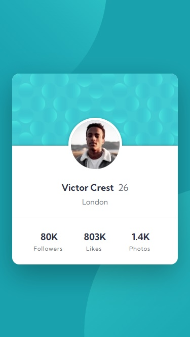

# Frontend Mentor - 3-column preview card component solution

This is a solution to the [Profile card component challenge on Frontend Mentor](https://www.frontendmentor.io/challenges/profile-card-component-cfArpWshJ). Frontend Mentor challenges help you improve your coding skills by building realistic projects.   

## Table of contents

- [Overview](#overview)
  - [The challenge](#the-challenge)
  - [Screenshot](#screenshot)
  - [Links](#links)
- [My process](#my-process)
  - [Built with](#built-with)
  - [What I learned](#what-i-learned)
  - [Continued development](#continued-development)
  - [Useful resources](#useful-resources)
- [Author](#author)

## Overview

### The challenge

- Preview of the responsive layout of the card with personal info and statistics.

### Screenshot
<div>
  
  
</div>

### Links

- Solution URL: [My solution URL](https://github.com/MiloosN5/FrontendMentor_3ColumnPreviewCard_Challenge)
- Live Site URL: [My live site URL](https://miloosn5.github.io/FrontendMentor_3ColumnPreviewCard_Challenge/)


## My process

### Built with

- Semantic HTML5 markup
- SASS - compiled into the CSS
- BEM
- Flexbox
- Grid
- Pseudo elements (before & after)
- Mobile-first workflow
- REM (Root EM) & EM (for Responsive)
- Responsive layout
- NPM
- Webpack 

### What I learned

* Understanding elements that are relative to something else. In this challenge, there are two circles that are related to the certain corner of the viewport & also avatar that is related to its ancestor ('profile__hero__personal'). 
    * **Decorative images (circles)**
        Since they depend on the corners of the viewport, they can be created as a pseudo elements (before & after) of 'body'.
        These pseudo elements allow you to insert “content” before and after any non-replaced element (e.g. they work on a <div> but not an <input> ). This effectively allows you to show something on a web page that might not be present in the HTML content. (via [CSS Tricks](https://css-tricks.com/7-practical-uses-for-the-before-and-after-pseudo-elements-in-css/)).
        The sizes and positions are different on the various devices. To avoid sudden change of different versions, it's way better to make transition progressively. You can achieve it with clamp() function. Use of online-avaiable fluid clamp calculator can be really helpfull. <br/>
        **Notes**: Links for some avaiable calculator can be found in the [Useful resources](#useful-resources) section.

        * before (the one in the upper-left corner) & after (the one in the down-right corner)
            ```scss
                body {
                    ...
                    &::before {
                        @include a.pseudo('content-empty');
                        @include a.container('w-bodyUpper', 'mw-none', 'h-bodyUpper', 'void');    
                        @include a.position('top-bodyUpper', 'right-auto', 'bottom-auto', 'left-bodyUpper');
                        @include a.border('b-none', 'br-100%');
                        @include a.bgImage('backgroundImage-bodyUpper', 'backgroundImage-cover', 'backgroundImage-norepeat');
                        @extend %position-absolute;
                        @extend %zIndexBehind;
                    }
                    &::after {
                        @include a.pseudo('content-empty');
                        @include a.container('w-bodyDown', 'mw-none', 'h-bodyDown', 'void');    
                        @include a.position('top-auto', 'right-bodyDown', 'bottom-bodyDown', 'left-auto');
                        @include a.border('b-none', 'br-100%');
                        @include a.bgImage('backgroundImage-bodyDown', 'backgroundImage-cover', 'backgroundImage-norepeat');
                        @extend %position-absolute;
                        @extend %zIndexBehind;
                    }
                }
            ```
    * **Avatar**
        This differes from previous case in the way that here we need drop shadow that is related to the ancestor element. The avatar element along with its ancestor created specific shape. The upper side of this shape need to have dropped shadow. With the same approach as with circles, we can make half job done. Problem lays in the fact that we need drop shadow of both anchestor element and avatar. Since the avatar is circular, its dropped shadow also appeared on its parent (ancestor). The solution is to make another absolute positioning, but this time on the avatar - avatar will be ancestor to its before and after pseudo elements. *Before* will be used for creating rectangle to overlay shadow that is dropped on the avatar's parent. *After* will be used for creating replica of the avatar image in the same place but without shadow.
        **Notes**: For better code organizing, 'mixins' were used. Purpose of using mixin directive is to create templates for some similar elements that shared same properties but can diffir with values. Values can be stored in the maps and then connected with the mixins using 'map.get' method.

        * avatar

            ```scss
                .profile {
                    &__hero {
                        &__personal {
                            &__avatar {
                                @extend %position-absolute;
                                @include a.position('top-avatar', 'right-auto', 'bottom-auto', 'left-auto');
                                @include a.container('w-avatar', 'mw-100%', 'h-avatar', 'dark-cyan');
                                @include a.bgImage('backgroundImage-avatar', 'backgroundImage-100%_100%', 'backgroundImage-norepeat');
                                @include a.border('b-none', 'br-100%');
                                @include a.outline('outline-avatar');
                                @include a.boxShadow('box-shadow-avatar');
                                &::before {
                                    @extend %position-absolute;
                                    @include a.pseudo('content-empty');
                                    @include a.container('w-avatar_Overlay', 'mw-none', 'h-avatar_Overlay', 'white');
                                    @include a.position('top-avatar_Overlay', 'right-auto', 'bottom-auto', 'left-Half_Negative');
                                }
                                &::after {
                                    @extend %position-absolute;
                                    @include a.pseudo('content-empty');
                                    @include a.position('top-0', 'right-0', 'bottom-0', 'left-0');
                                    @include a.container('w-avatar', 'mw-100%', 'h-avatar', 'dark-cyan');
                                    @include a.bgImage('backgroundImage-avatar', 'backgroundImage-100%_100%', 'backgroundImage-norepeat');
                                    @include a.border('b-none', 'br-100%');
                                }
                            }
                        }
                    }
                }
            ```
        * maps

            ```scss
                $grid: (
                    // columns
                    'grid-template-columns-stats-MOBILE': 1fr,
                    'grid-template-columns-stats-DESKTOP': repeat(3, 1fr),
                    'grid-template-columns-header': 1fr,
                    // rows
                    'grid-template-rows-auto': auto,
                    // gap
                    'grid-gap-0': 0,
                );
            ```
        * mixins

            ```scss
            //----------------------- GRID -----------------------//
                @mixin grid($template-columns, $template-rows, $gap) {
                    display: grid;
                    grid-template-columns: map.get(v.$grid, $template-columns);
                    grid-template-rows: map.get(v.$grid, $template-rows);
                    gap: map.get(v.$grid, $gap)
                }
            ```

### Continued development

* In-depth explorating of Webpack & Sass.
* Aspiration to make better responsive layout.
* Aspiration to make better SASS organization.
* Tending to improve BEM naming convention.

### Useful resources

- [Webpack Course - Colt Steele (Youtube)](https://www.youtube.com/playlist?list=PLblA84xge2_zwxh3XJqy6UVxS60YdusY8) - Webpack configuration - really helpful to understand difference between 'development' & 'production' configuration. Also, comprehensible explanations and straight to the point.
- [Webpack - Official documentation](https://webpack.js.org/) - Webpack official documentation - everytime you struggle with understanding something about webpack (ex. plugins), there you can found explanation. 
- [BEM](https://en.bem.info/) - BEM naming convention is also really important for any projects, expecially the bigger ones.
- [SASS](https://sass-lang.com/documentation/at-rules) - You can found detailed documentation on the official page of the SASS. Check out for example "at-rules".
- [7-1 pattern SASS](https://sass-guidelin.es/#component-structure) - "7-1" pattern is one of the most used sass organization. It is also very pratical. 
- [Clamp calculator](https://royalfig.github.io/fluid-typography-calculator/) - Since there are so many different devices, desirable is to make your font fluid from one size to another.
- [Fluid-responsive property calctor](https://websemantics.uk/tools/fluid-responsive-property-calculator/) - One of the main difference that the one above is that accept negative values.
- [Media Query](https://css-tricks.com/a-complete-guide-to-css-media-queries/) - A Complete Guide to (CSS) Media Queries.
- [Responsive images](https://developer.mozilla.org/en-US/docs/Learn/HTML/Multimedia_and_embedding/Responsive_images) - How to make images responsive.
- [Typographic Hierarchy](https://www.toptal.com/designers/typography/typographic-hierarchy) - Understanding your website structure/hierarchy sometimes can be difficult. Determing accurately typography can be half job done. 
- [An Introduction to Block Element Modifiers (BEM)](https://opensenselabs.com/blog/articles/introduction-block-element-modifiers) - Difference between Block, Modifier and Element.
- [Understanding CSS BEM](https://codeburst.io/understanding-css-bem-naming-convention-a8cca116d252) - Examples of how BEM class namings can be done.
- [BEM 101](https://css-tricks.com/bem-101/) - Another source about BEM.
- [Pseudo elements](https://css-tricks.com/7-practical-uses-for-the-before-and-after-pseudo-elements-in-css/)
- [Maps](https://sass-lang.com/documentation/values/maps/) - Useful for storing values that later will be connected with eg. mixins.
- [Drop shadow - Complex](https://stackoverflow.com/questions/32772260/clipping-a-circle-box-shadow-where-it-overlaps-square-div) - Case in this challenge is almost the identical with the one in the link.

## Author

- GitHub - [MiloosN5](https://github.com/MiloosN5)
- Frontend Mentor - [@MiloosN5](https://www.frontendmentor.io/profile/MiloosN5)


